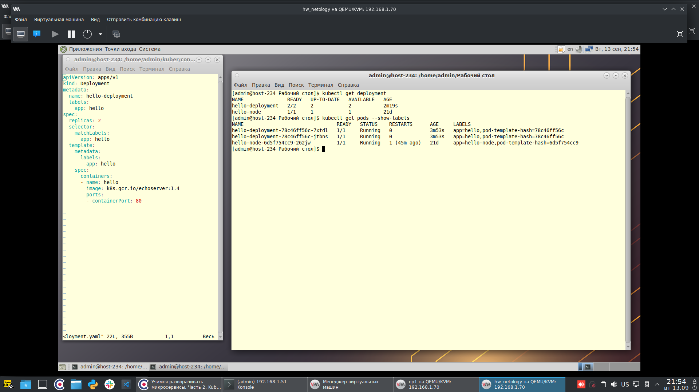
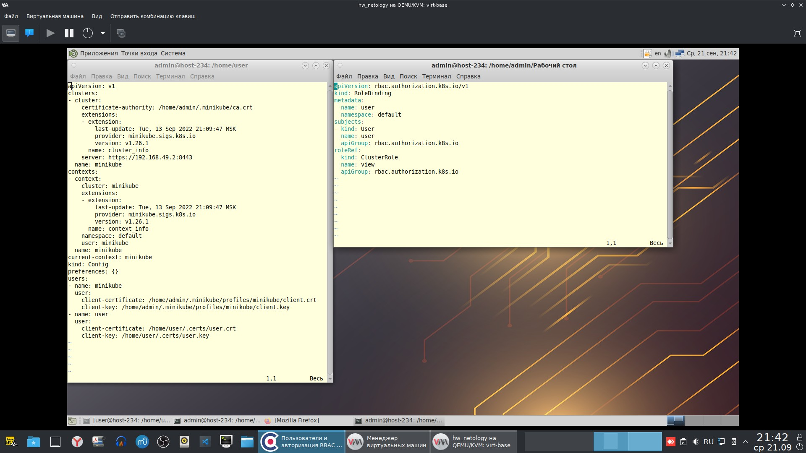
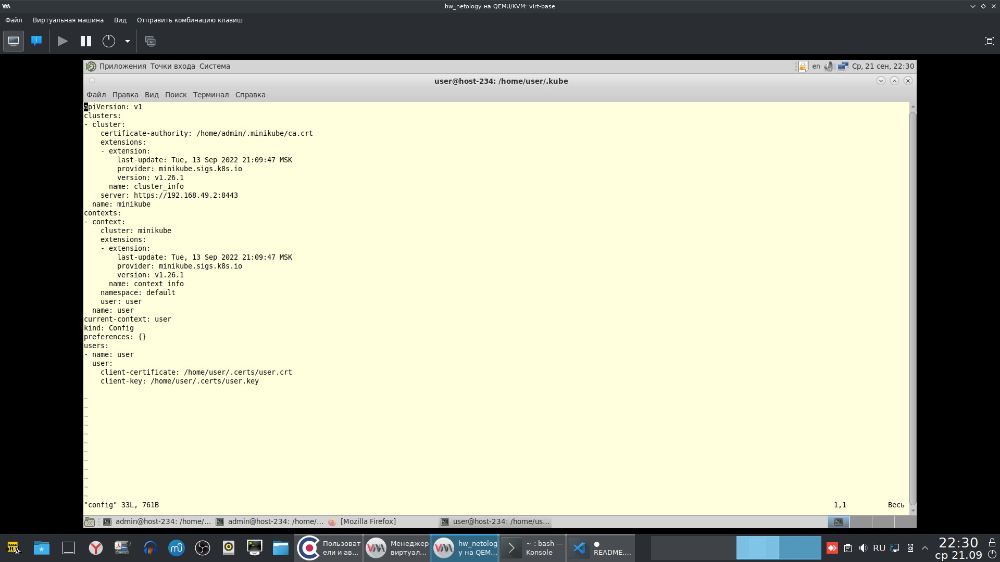
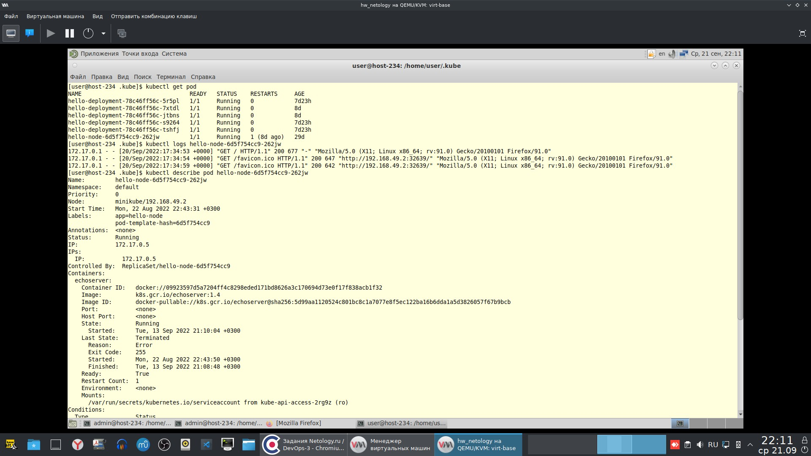

# Домашнее задание к занятию "12.2 Команды для работы с Kubernetes"

### Задание 1: Запуск пода из образа в деплойменте

### Задание 2: Просмотр логов для разработки

На скриншоте config. Добавлен пользователь user, для него сделаны сертификаты с помощью openssl по этой инструкции: https://habr.com/ru/company/flant/blog/470503/

Затруднения возникли из-за того, что редактировал свой config, а новому пользователю его не добавил.
Его конфиг выглядит так:

Вывод команд:
*kubectl logs hello-node-6d5f754cc9-262jw* и 
*kubectl describe pod hello-node-6d5f754cc9-262jw*

Команды выполнялись от имени нового пользователя.